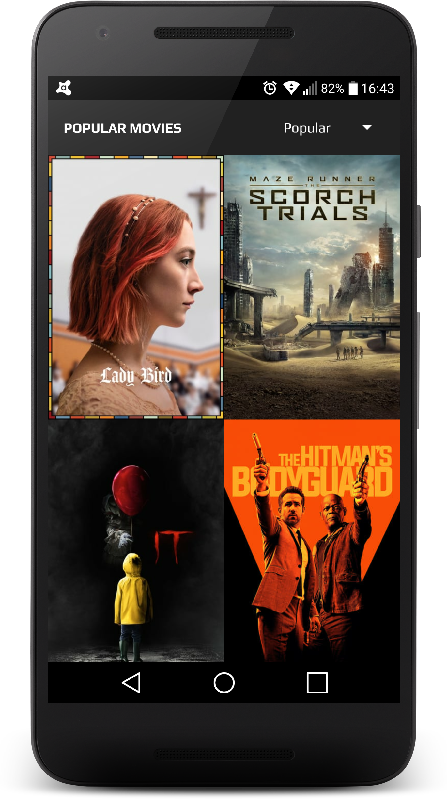
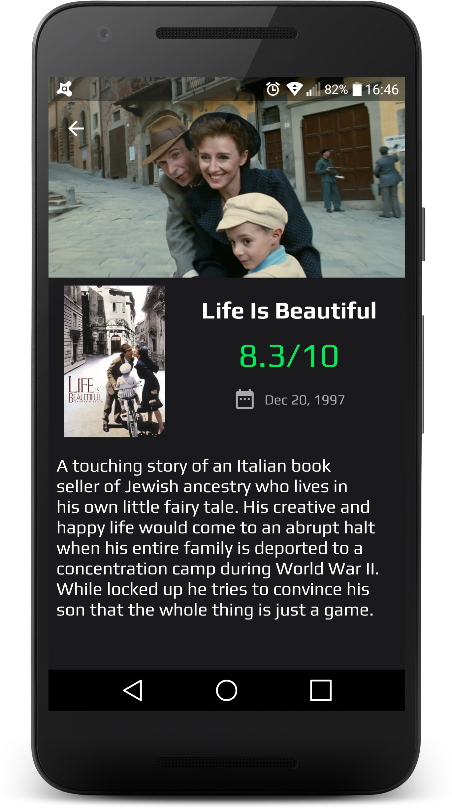
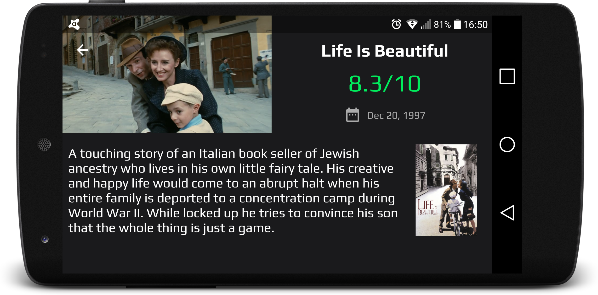

## Popular Movies Stage 1

### Configuration

In order to run this project, you need to get an **API key** from [**TMDb**](https://www.themoviedb.org/).

You need to set your api key in your `gradle.properties` file as following:

    tmdbApiKey = your-api-key

### Screenshots

Movie List             |  Movie Detail
:-------------------------:|:-------------------------:
  |  

Movie List Landscape             |  Movie Detail Landscape
:-------------------------:|:-------------------------:
  |  

### Credits

#### Icons
Icon 1 | Icon 2
:-------------------------:|:-------------------------:
 | 

#### Gifs

https://media.giphy.com/media/jWexOOlYe241y/giphy.gif

https://gfycat.com/gifs/detail/ThirdEasygoingDeermouse

## License

Copyright 2018 Figen Güngör

Licensed under the Apache License, Version 2.0 (the "License");
you may not use this file except in compliance with the License.
You may obtain a copy of the License at

    http://www.apache.org/licenses/LICENSE-2.0

Unless required by applicable law or agreed to in writing, software
distributed under the License is distributed on an "AS IS" BASIS,
WITHOUT WARRANTIES OR CONDITIONS OF ANY KIND, either express or implied.
See the License for the specific language governing permissions and
limitations under the License.